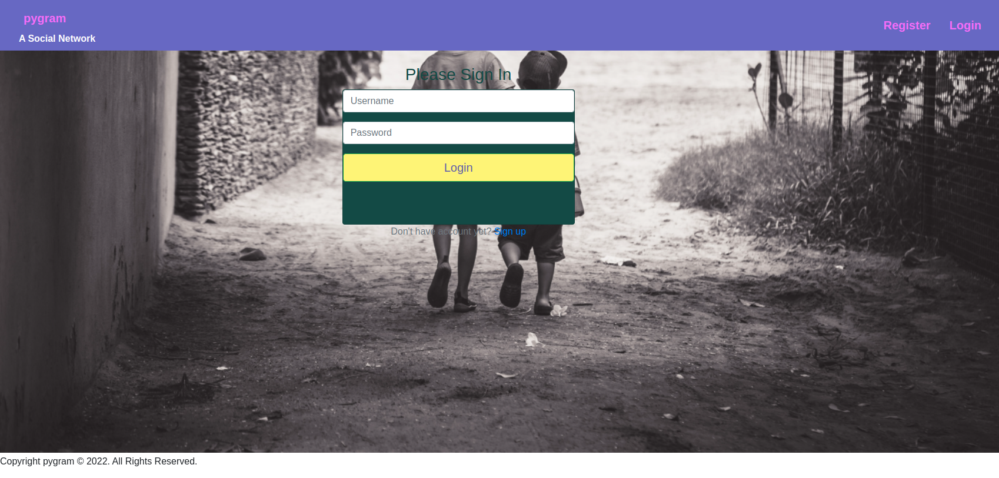

# pygram

##### By Lillian Muita

## Table of Contents

- [Description](#Description)
- [Installation Requirements](#installation-requirements)
- [Technology Used](#technologies-used)
- [Licence](#licence)
- [Authors Info](#author-Info)

## Description

A django based application that is a replication of the instagram app. Users are able to log in, register if they have no accounts.Like pictures and comment on pictures as well as search users based on their profile.Users are also able to update their profiles and add posts.

## Installation Requirements

### Prerequisites

- Django
- Pipenv & Python
- Pillow 
- Postgres Database

### Instructions

### Cloning

$ git clone https://github.com/limu2030/photo-app

Move into directory and install requirements

$ cd instagram-clone

$ pipenv install request

Install and activate a Virtual Environment

$ pipenv shell
 

### Set-up a Database

Set your database User and Password 

### Make Migrations & Migrate

$ python manage.py makemigrations <DB Name> 

$ python manage.py migrate 

### Run the application

python manage.py runserver 

## Technologies Used

- Python
- Bootstrap
- Django
- Bootstrap
- Pillow
- Crispy forms

## License

[MIT License](LICENSE)

### Authors Info

email: lillian.muita@student.moringaschool.com

